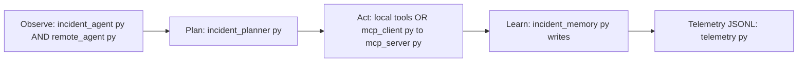
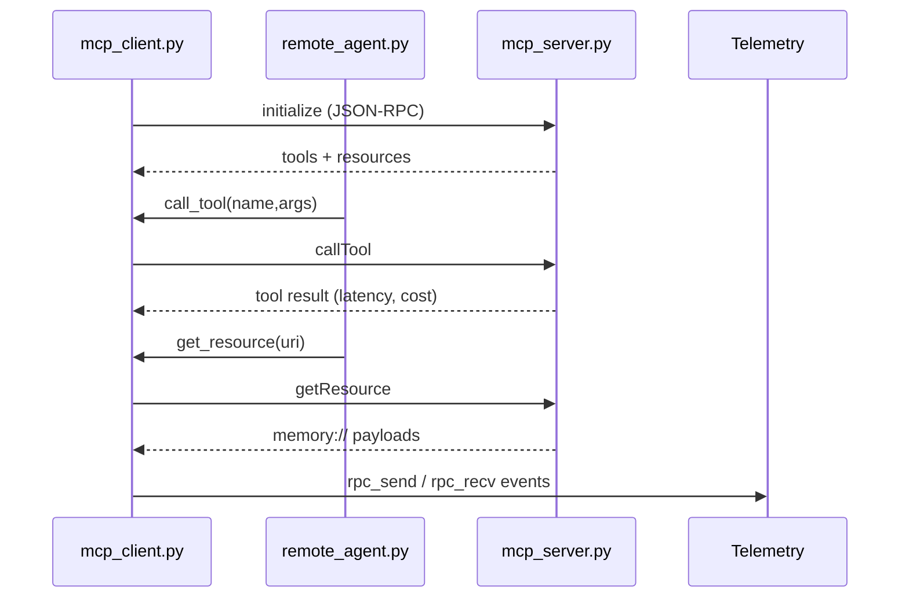
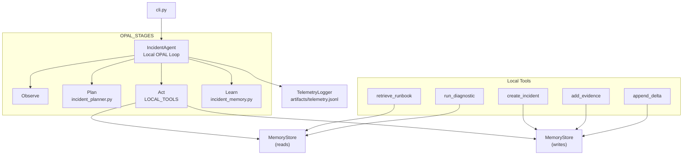
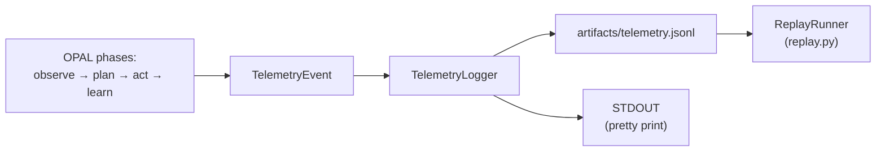

# Week 04 — Agentic Incident Command Capstone

## 1. Executive Overview
The Week 04 capstone delivers a deterministic Incident Command Agent that runs the OPAL loop (Observe → Plan → Act → Learn) across two execution paths: a local deterministic agent and a remote MCP-driven agent. The implementation keeps all state in `memory://` resources, uses JSON-RPC over WebSockets for the MCP path, and records every phase to JSONL telemetry for later replay.

- **OPAL in this repo:** `IncidentAgent` (local) and `RemoteIncidentAgent` (remote) execute `observe()` → `plan()` → `act()` → `learn()` with guardrails for maximum steps, retries, and latency budgets. Each phase emits structured telemetry with correlation and loop identifiers.
- **Local Deterministic Agent:** Runs entirely in-process with direct tool handlers defined in `incident_agent.py`, no MCP dependency, and deterministic outputs backed by `IncidentMemoryStore`.
- **Remote MCP Agent:** Uses `mcp_client.py` to talk to `mcp_server.py` over WebSockets, invoking tools via `callTool` and fetching resources with `getResource`, while still planning locally.
- **Replay mode & telemetry:** All runs log to `artifacts/telemetry.jsonl` via `TelemetryLogger`. `replay.py` reconstructs the OPAL timeline from that JSONL for audits, demos, or debugging.

## 2. Table of Contents
- [Overview](#1-executive-overview)
- [Architecture](#3-architecture-diagrams-mermaid)
- [Components](#4-module-documentation-file-by-file)
- [Usage](#5-usage-instructions-with-real-commands)
- [Guardrails](#6-guardrails--validation)
- [Telemetry](#7-telemetry-system)
- [Tests](#8-tests--validation)

## 3. Architecture Diagrams (Mermaid)
**A. OPAL Loop**


**B. MCP Server ↔ Client Flow**


**C. Local Deterministic Tool Flow**


**D. Telemetry Logging Pipeline**


# 4. Module Documentation (File-by-File)

## Overview Table

| Module | Role | Key Responsibilities | Telemetry |
|-------|------|----------------------|-----------|
| `incident_agent.py` | Local OPAL loop executor | Runs observe → plan → act → learn locally; pure deterministic tools; guardrails; writes deltas/plans | Full OPAL phase events |
| `remote_agent.py` | Remote OPAL loop executor | Delegates Act/Learn to MCP via WebSockets; same guardrails; fetches memory resources | OPAL + rpc_send/rpc_recv |
| `mcp_server.py` | JSON-RPC MCP server | initialize, getResource, callTool; deterministic envelopes; schema validation | Request/response logging |
| `mcp_client.py` | Telemetry-enabled MCP client | RPC wrapper with telemetry; manages Budget and session lifecycle | rpc_send + rpc_recv |
| `incident_planner.py` | Deterministic planner | Fixed 5-step plan; predictable for testing/replay | plan_start/end |
| `incident_memory.py` | Memory store | Backing store for all memory:// URIs; read/write deltas, plans, evidence | learn_start/end |
| `incident_schemas.py` | Tool/resource schemas | JSON schemas, descriptors, validation helpers | (indirect) via server |
| `telemetry.py` | Telemetry data model | TelemetryEvent, Budget, RunContext, TelemetryLogger | Writes JSONL events |
| `replay.py` | Telemetry replay engine | Event loader, normalizer, ordered playback | Reads JSONL sink |
| `cli.py` | Local runner / Replay CLI | Runs OPAL loop or replay mode | Mirrors agent telemetry |
| `demo_remote.py` | Remote agent demonstration | Runs remote OPAL loop via MCP server | Shared telemetry sink |

---

## Detailed Notes

### incident_agent.py
- Executes the local deterministic OPAL loop with in‑process tool handlers (no MCP dependency).
- Defines pure, deterministic local tools: `retrieve_runbook`, `run_diagnostic`, `summarize_incident`, `create_incident`, `add_evidence`, `append_delta`.
- Guardrails: `max_steps=5`, `max_latency_ms=150`, `max_retries=2`.
- Emits structured telemetry for every phase: `observe_start/end`, `plan_start/end`, `plan_guardrail`, `act_start/guardrail/end`, `learn_start/end`.
- Uses `RunContext` + `Budget(tokens=2000, ms=150, dollars=0.0)`.
- `run_loop()` batches callTool steps and writes deltas/plans in Learn.

### remote_agent.py
- Runs OPAL loop but delegates Act/Learn via WebSockets using `mcp_client.py`.
- Planning stays local.
- Same guardrails as local agent.
- Produces telemetry on MPC failures with `status="error"`.
- Uses MCP reads to fetch: `memory://deltas/recent`, `memory://plans/current`.

### mcp_server.py
- JSON‑RPC WebSocket server exposing: `initialize`, `getResource`, `callTool`.
- Deterministic envelopes:
  ```json
  {"status": "ok", "data": {...}, "metrics": {"latency_ms": X}}
  ```
- Default endpoint: `ws://127.0.0.1:8765/mcp`.
- Advertises resources:  
  `memory://incidents/{id}`, `memory://evidence/{id}`, `memory://deltas/recent`,  
  `memory://plans/current`, `memory://alerts/latest`, `memory://runbooks/index`,  
  `memory://memory/deltas`.
- Validates tool inputs using schemas.
- Telemetry logs request/response pairs with correlation ID, loop ID, latency.

### mcp_client.py
- Telemetry‑aware JSON‑RPC client.
- Wraps all remote calls (`initialize`, `call_tool()`, `get_resource()`) in:
  - `rpc_send`
  - `rpc_recv`
- Stores `Budget` per client.
- Lifecycle: `connect()` → calls → `close()`.

### incident_planner.py
- Deterministic planner (always same 5 steps):
  1. retrieve_runbook  
  2. run_diagnostic  
  3. create_incident  
  4. add_evidence  
  5. summarize_incident
- Predictable for testing and replay.

### incident_memory.py
- Backing store for all `memory://` URIs.
- Seeds alerts, runbooks, incidents, evidence, deltas.
- Core methods:
  `write_delta()`, `append_delta()`, `write_plan()`,  
  `write_evidence()`, `update_incident()`,  
  `get_resource()`, `list_resources()`.
- Supports both local and remote (via MCP).

### incident_schemas.py
- JSON schemas for all tools/resources.
- MCP server uses these for validation and initialize() descriptors.
- Helpers: `tool_descriptions()`, `resource_descriptions()`.

### telemetry.py
- Contains `TelemetryEvent`, `Budget`, `RunContext`.
- TelemetryLogger writes JSONL → `artifacts/telemetry.jsonl`.
- Timestamps injected at write time.
- Includes measurement helper `timed()`.

### replay.py
- `load_events()` loads JSONL and normalizes timestamps.
- `ReplayRunner.replay()` prints events `[001]`, `[002]`, … with metadata.
- Includes `simulate_tool_envelope()`.

### cli.py
- Runs local OPAL loop.
- `--replay <path>` streams JSONL telemetry using ReplayRunner.
- Remote execution lives in `demo_remote.py`.

### demo_remote.py
- Connects to MCP server, runs remote OPAL loop.
- Shares telemetry sink with server for correlated traces.

## 5. Usage Instructions (With Real Commands)
### A. Local Deterministic Agent
Run the in-process OPAL loop using the local `IncidentAgent` (no MCP server required):
```bash
python 02_incident_command_agent/cli.py
```
A representative excerpt of the telemetry (trimmed for clarity and full telemetry is verbose):
```text
observe_start
observe_end: resources[...]

plan_start
plan_end: [retrieve_runbook, run_diagnostic, create_incident, add_evidence, summarize_incident]

act_start
act_end: all tool calls ok

learn_start
learn_end: deltas_written=5
```

### B. Remote MCP Mode
Terminal A (server):
```bash
python 02_incident_command_agent/mcp_server.py
```
Terminal B (client/agent):
```bash
python 02_incident_command_agent/demo_remote.py
```
Expected excerpt (trimmed):
```text
MCP server listening on ws://127.0.0.1:8765/mcp
=== Remote OPAL Summary ===

observations: tools[...] resources[...]

plan:
  - retrieve_runbook
  - run_diagnostic
  - create_incident
  - add_evidence
  - summarize_incident

results:
  retrieve_runbook → ok
  run_diagnostic   → ok
  create_incident  → ok
  add_evidence     → ok
  summarize_incident → ok

learn:
  deltas: [...]
  plan:   [...]
```

### C. Replay Telemetry Mode
```bash
python 02_incident_command_agent/cli.py --replay artifacts/telemetry.jsonl
```
Expected excerpt:
```text
[001] observe_start  :: initialize       :: ok :: 0ms
[002] rpc_send       :: initialize       :: ok :: 0ms
[003] rpc_recv       :: initialize       :: ok :: 0ms
[004] plan_start     :: planner          :: ok :: 0ms
...
[156] learn_start    :: memory_write     :: ok :: 0ms
[157] learn_end      :: memory_write     :: ok :: 0ms
```

### D. Tool Harness Test (Week 04 official warm-up)
Terminal A:
```bash
python 01_tool_harness/mcp_tool_harness_server.py
```
Terminal B:
```bash
python 01_tool_harness/mcp_tool_harness_client.py
```
Expected excerpt (trimmed):
```text
MCP harness server running at ws://127.0.0.1:8765/mcp
{
  "delta": {
    "alert_id": "ALRT-0001",
    "action": "loop_complete",
    "summary": "..."
  },
  "results": [
    {
      "result": {
        "status": "ok",
        "metrics": { "latency_ms": 1 },
        ...
      }
    },
    ...
  ]
}
```

## 6. Guardrails & Validation

- **Shared budgets:** Both agents use the same execution budget  
  `Budget(tokens=2000, ms=150, dollars=0.0)`  
  with guardrails enforced during `act()`:
  - `max_steps = 5`
  - `max_latency_ms = 150` (cumulative per loop)
  - `max_retries = 2`

- **Cumulative latency guardrail:**  
  Every tool invocation contributes to a running latency total.  
  When cumulative latency exceeds `max_latency_ms`, the agent halts the phase and logs:
- `plan_guardrail` (if the violation occurred during planning)
- `act_guardrail` (if the violation occurred during action execution)

- **Retry guardrail:**  
  If a tool fails more than `max_retries` times in a single OPAL loop, execution halts and telemetry records the failure reason.

- **Schema validation (MCP server):**  
  `mcp_server.py` validates all `callTool` arguments against  
  `incident_schemas.get_tool_schemas()`.  
  Invalid arguments produce structured JSON-RPC errors.

- **Unknown tools:**  
  - Local path: `{"status": "error", "error": "Unknown local tool: <name>"}`  
  - Remote MCP path: JSON-RPC `-32601` (Method Not Found)

- **Deterministic execution:**  
  - Local agent uses seeded `IncidentMemoryStore` and in-process tool handlers.  
  - Remote agent uses fixed tool envelopes (latency, cost, deterministic output) exposed by `mcp_server.py`.  
  This ensures reproducible telemetry and stable replay behavior.

## 7. Telemetry System

### Event schema (`TelemetryEvent`)
Each telemetry event contains:

- `correlation_id` — run-level UUID generated via `new_correlation_id()`
- `loop_id` — identifies each OPAL iteration (e.g., `loop-1`)
- `phase` — one of `observe_*`, `plan_*`, `act_*`, `learn_*`, `rpc_send`, `rpc_recv`
- `method` — operation invoked (e.g., `list_resources`, `retrieve_runbook`, `callTool`)
- `status` — `"ok"` or `"error"`
- `latency_ms` — measured latency for that step
- `budget` — snapshot of the remaining execution budget
- `payload` — structured, phase-specific data
- `timestamp` — appended at write time

---

### Correlation model

- A **single correlation ID** ties all events of a run together.
- `loop_id` increments for each OPAL cycle (typically just `loop-1`).

---

### Phases emitted

- `observe_start` / `observe_end`
- `plan_start` / `plan_end` / `plan_guardrail`
- `act_start` / `act_end` / `act_guardrail`
- `learn_start` / `learn_end`
- `rpc_send` / `rpc_recv` from the MCP client
- MCP server also logs every request/response with the same correlation + loop identifiers.

---

### Sink behavior

`TelemetryLogger` prints each event and writes JSONL lines to:

`artifacts/telemetry.jsonl`

This file is shared by:

- `cli.py` (local agent)
- `demo_remote.py` (remote agent)
- `mcp_server.py` (server logs)

Shared logging allows for **fully correlated replay** of both local and remote runs.

---

### Example telemetry event
```json
{
  "correlation_id": "49e30fc6-0aac-45d3-bf5c-30c9c9756b3d",
  "loop_id": "loop-1",
  "phase": "act_end",
  "method": "callTool_batch",
  "status": "ok",
  "latency_ms": 5,
  "budget": {"tokens": 2000, "ms": 150, "dollars": 0.0},
  "payload": {
    "results": [...],
    "cumulative_latency_ms": 5
  },
  "timestamp": 1764265285.6678212
}
```

## 8. Tests & Validation

- **Run the Tool Harness Test:**  
  `mcp_tool_harness_client.py` connects to the warm-up server (`mcp_tool_harness_server.py`) and executes a full initialize → getResource → callTool sequence.  
  Telemetry is written to `samples/client_telemetry.log`.

- **Validate remote MCP agent roundtrip:**  
  `demo_remote.py` (client) + `mcp_server.py` (server) perform a full remote OPAL run, including initialize, getResource, and multiple callTool invocations.  
  All RPC traffic and OPAL phases are logged to `artifacts/telemetry.jsonl`.

- **Validate local deterministic OPAL loop:**  
  Running `cli.py` (with no flags) executes the local OPAL loop against `IncidentMemoryStore` and emits telemetry for every step.

- **Validate replay mode:**  
  `cli.py --replay artifacts/telemetry.jsonl` reconstructs the OPAL timeline using `ReplayRunner`, useful for debugging or demonstrations.

> **Note:**  
> These validations are *manual functional tests*—the capstone does not include an automated pytest suite.


