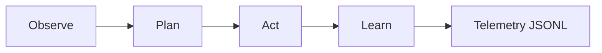
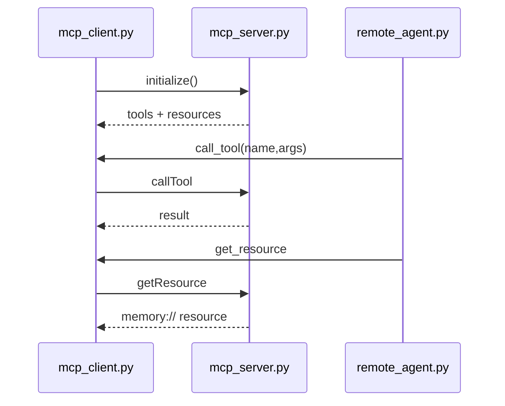
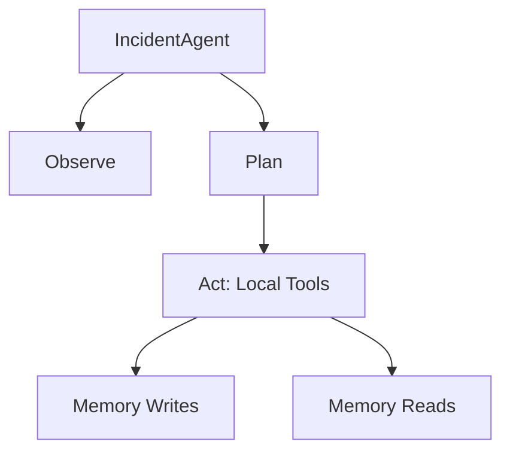

<table width="100%">
<tr>
<td style="vertical-align: top;">

<h1>Week 04 Capstone — Agentic Incident Command</h1>

<p>
Incident Command Agent using the PAL loop (Observe → Plan → Act → Learn) across:

- **Local deterministic agent** — pure in‑process tools, deterministic outputs.
- **Remote MCP agent** — uses JSON‑RPC over WebSockets to communicate with the MCP server.
- **Shared telemetry system** — every OPAL phase logs structured JSONL to `artifacts/`.

All state lives inside <code>memory://resources</code>, making the entire workflow deterministic, replayable, and ideal for debugging or demos.
</p>

</td>

<td align="right" width="200">

</td>

</tr>
</table>

---

## 1. Architecture 

### A. OPAL Loop


### B. MCP Client–Server Flow


### C. Local Deterministic Tool Flow


---

## 2. Module-by-Module Summary

| Module | Purpose | Telemetry |
|-------|----------|-----------|
| `incident_agent.py` | Local OPAL executor, deterministic tools, guardrails | Full OPAL phases |
| `remote_agent.py` | Same OPAL loop with MCP for Act/Learn | OPAL + rpc_send/recv |
| `mcp_server.py` | WebSocket JSON-RPC server exposing tools/resources | Request/response logs |
| `mcp_client.py` | Telemetry-enabled RPC client | rpc_send + rpc_recv |
| `incident_planner.py` | Fixed 5‑step OPAL plan | plan_start/end |
| `incident_memory.py` | Backing store for all memory:// URIs | learn_start/end |
| `incident_schemas.py` | Schemas for tools/resources | Used by server |
| `telemetry.py` | Event model & JSONL logger | All phases |
| `replay.py` | Replay OPAL trace from telemetry | Reads JSONL |
| `cli.py` | Local runner + replay mode | Mirrors telemetry |
| `demo_remote.py` | Remote MCP agent runner | Shared sink |

---

## 3. Key Features

### Deterministic Planning
The planner always returns the same ordered 5-step OPAL plan:

1. `retrieve_runbook`
2. `run_diagnostic`
3. `create_incident`
4. `add_evidence`
5. `summarize_incident`

### Deterministic Tools
Local and remote tools return predictable synthetic envelopes with:

```json
{ "status": "ok", "data": {...}, "metrics": { "latency_ms": X }}
```

### Telemetry Everywhere
Each OPAL phase emits:

- `observe_start/end`
- `plan_start/end`
- `act_start/end`
- `learn_start/end`
- `rpc_send/recv` (remote only)

Saved to:

```
artifacts/telemetry.jsonl
```

Replay available via:

```
python cli.py --replay artifacts/telemetry.jsonl
```

---

## 4. Usage

### A. Local Deterministic OPAL Run
```bash
python 02_incident_command_agent/cli.py
```

### B. Remote MCP Run
Terminal A:
```bash
python 02_incident_command_agent/mcp_server.py
```

Terminal B:
```bash
python 02_incident_command_agent/demo_remote.py
```

### C. Telemetry Replay
```bash
python 02_incident_command_agent/cli.py --replay artifacts/telemetry.jsonl
```

---

## 5. Guardrails

- `Budget(tokens=2000, ms=150, dollars=0.0)`
- `max_steps = 5`
- `max_retries = 2`
- Cumulative latency tracked per OPAL loop
- Guardrail events: `plan_guardrail`, `act_guardrail`

---

### 6. Run Screenshots

#### A. MCP Server Startup


#### B. Remote OPAL Loop Execution


#### C. Telemetry JSONL Confirmation


---