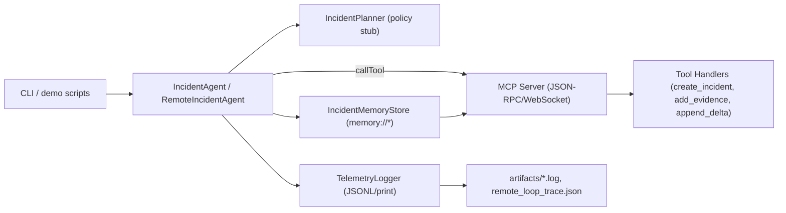

# Incident Command Agent — Week 04 Capstone

  

Single-folder capstone for Week 04 of **The AI Engineer**: a deterministic Incident Command Agent built around the MCP protocol, OPAL (Observe → Plan → Act → Learn) loops, and the memory/trace conventions from Week 03. The repo contains both a warm-up MCP tool harness and the full incident agent skeleton with local and remote execution paths.

---

## Architecture Overview



### OPAL Loop (as implemented)
- **Observe**: fetch MCP capabilities/resources (remote path) or enumerate `memory://` resources (local path).
- **Plan**: deterministic planner stub emits a fixed set of `callTool` steps (create incident, add evidence, append delta).
- **Act**: execute steps via MCP `callTool` RPCs or direct local dispatch; record results.
- **Learn**: append deltas and store the last plan in `memory://deltas/recent` and `memory://plans/current`; optionally fetch updated resources (remote agent).

Determinism and offline safety come from canned tool logic, in-memory state, and no external network calls beyond the local websocket.

---

## Repository Map

### 01_tool_harness/ (warm-up)
- `mcp_tool_harness_server.py` — Minimal MCP server exposing stub tools/resources with telemetry.
- `mcp_tool_harness_client.py` — Single OPAL loop client driving initialize/getResource/callTool/learn.
- `schemas.py` — JSON schemas for tools and `memory://` fixtures.
- `telemetry.py` — Correlation IDs, budgets, JSONL telemetry logger, timing helper.
- `samples/*.log` — Example JSONL telemetry for server and client runs.
- `README_tool_harness.md` — Module-level documentation.

### 02_incident_command_agent/ (capstone)
- `incident_agent.py` — Local OPAL loop orchestrator (uses memory + planner, direct tool dispatch).
- `remote_agent.py` — Remote OPAL loop orchestrator using the MCP client.
- `incident_planner.py` — Deterministic planner stub emitting three `callTool` steps.
- `incident_memory.py` — `memory://` store for incidents, evidence, deltas, and plans; read/write helpers.
- `incident_schemas.py` — Tool/resource schemas and capability descriptors.
- `mcp_server.py` — JSON-RPC WebSocket server exposing initialize/getResource/callTool with stub handlers.
- `mcp_client.py` — Minimal MCP client with incrementing IDs and helpers.
- `cli.py` — Local CLI stub that runs one OPAL loop via `IncidentAgent`.
- `demo_remote.py` — Demonstrates remote OPAL loop against the MCP server.
- `telemetry.py` — Telemetry models/logger (print + JSONL sink).
- `replay.py`, `memory_store.py`, `orchestrator.py` — Legacy placeholders kept for parity with Week 03 interfaces.
- `artifacts/` — Captured traces (`remote_loop_trace.json`, client/server logs).

---

## Setup

```bash
python -m venv .venv
source .venv/bin/activate
pip install websockets
```

All code is self-contained with no external APIs; runs fully offline.

---

## Run Instructions

### Warm-Up Harness
1. Start the MCP server:  
   `python 01_tool_harness/mcp_tool_harness_server.py`
2. In another terminal, run the client OPAL loop:  
   `python 01_tool_harness/mcp_tool_harness_client.py`
3. Inspect logs in `01_tool_harness/samples/` for telemetry.

### Incident Command Agent (Local)
1. Run the local agent once via CLI:  
   `python 02_incident_command_agent/cli.py`
2. Output prints the OPAL summary and writes telemetry to `telemetry.log`.

### Incident Command Agent (Remote via MCP)
1. Start the MCP server:  
   `python 02_incident_command_agent/mcp_server.py`
2. In another terminal, run the remote demo:  
   `python 02_incident_command_agent/demo_remote.py`
3. Observe the OPAL summary and review `02_incident_command_agent/artifacts/` for the saved trace.

Offline mode is default: tool handlers and memory stores use canned data; no network calls are issued.

---

## Extending the Agent

- **Add tools**: define schemas in `incident_schemas.py`, add handlers in `mcp_server.py::call_tool`, and emit planner steps in `incident_planner.py`.
- **Extend memory**: add new `memory://` URIs and accessors in `incident_memory.py`; advertise them through `resource_descriptions()`.
- **Telemetry & replay**: route all OPAL phases through `TelemetryLogger` (similar to the warm-up harness) and persist JSONL for replay in `replay.py`.
- **Budgeting & safety**: enforce `Budget` limits in planner/agent, add retries/backoff on MCP failures, and validate arguments against JSON schemas before dispatch.
- **Multi-agent patterns**: layer additional planners or reviewers by composing multiple `RemoteIncidentAgent` instances targeting the same MCP server with isolated `RunContext` IDs.

---

## Submission Notes (Kaggle / GitHub)

- Keep artifacts (`artifacts/*.json`, `samples/*.log`) to demonstrate deterministic runs, but avoid committing large transient logs.
- Ensure README badges and links remain public-safe; no local machine paths are referenced.
- If packaging, include `websockets` in requirements and pin Python >= 3.10.
- Use `demo_remote.py` output as the canonical reproducibility proof for grading/submission.

---

## Missing Pieces & Fixes

- Telemetry integration in `mcp_server.py`, `incident_agent.py`, and `remote_agent.py` is minimal; wire `TelemetryLogger` events for observe/plan/act/learn with correlation IDs.
- Budgets are defined but not enforced; add timers/token tracking and short-circuit when limits are exceeded.
- Planner is a fixed stub; replace with model- or rule-driven planning plus safety rails and schema validation of steps.
- `memory_store.py`, `orchestrator.py`, and `replay.py` are placeholders; either remove or forward to the canonical implementations.
- MCP server lacks argument validation and error handling; validate against `incident_schemas.py` and return structured errors.
- CLI lacks flags/config; add YAML config loading, offline/remote mode switch, and replay/debug options.
